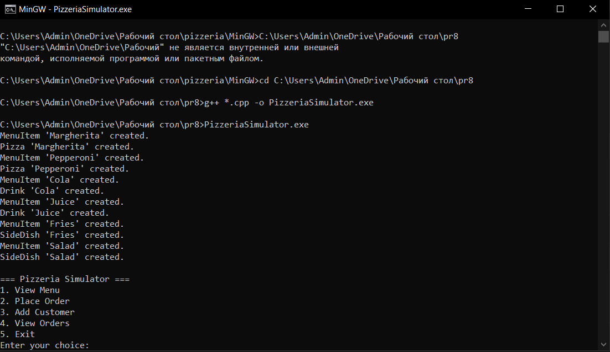
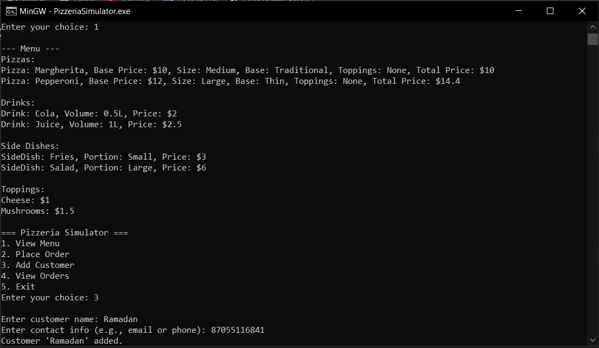
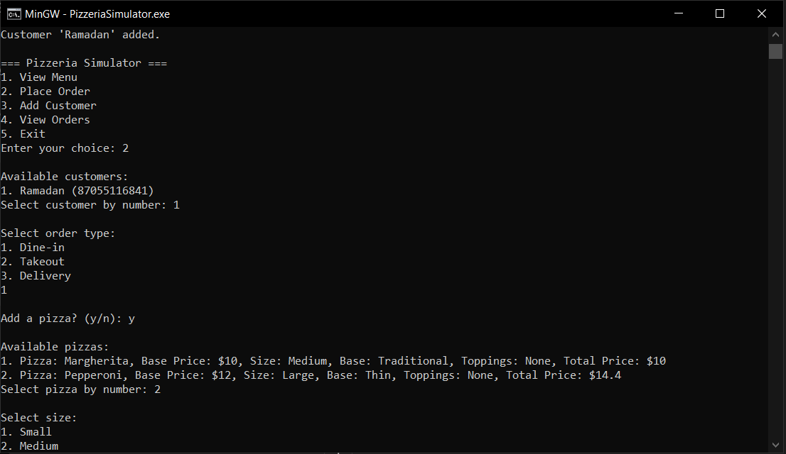
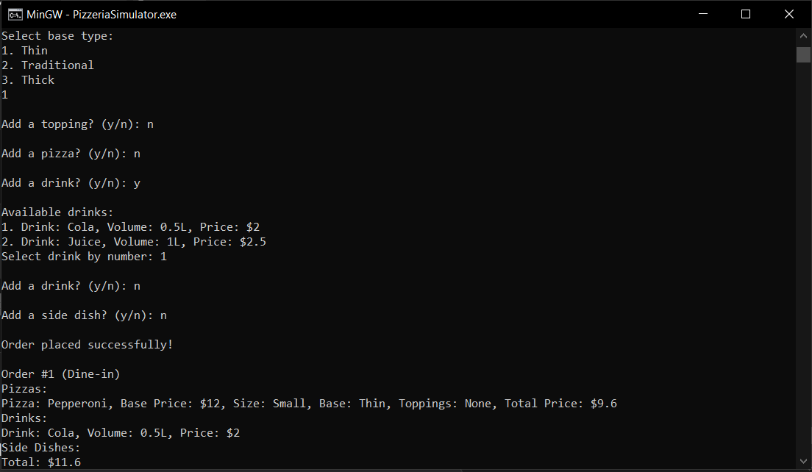

# Практическая работа №8. Симулятор пиццерии

## Описание проекта

Данный проект является практической работой по программированию на C++. Реализована консольная программа, имитирующая процесс заказа в пиццерии. Проект демонстрирует проектирование иерархии классов, взаимодействие между объектами, обработку заказов и управление списком клиентов.

## Симулятор пиццерии

### Описание

Консольное приложение, позволяющее пользователю формировать заказы в пиццерии. Поддерживаются различные типы позиций в меню (пиццы, напитки, закуски), кастомизация пицц с выбором размера, типа теста и топпингов, а также обработка разных типов заказов (в зале, на вынос, доставка). Программа включает базовое управление списком клиентов.

### Функциональность

- Создание меню с пиццами, напитками и закусками.
- Кастомизация пицц: выбор размера (маленькая, средняя, большая), типа теста (тонкое, традиционное, толстое) и добавление топпингов.
- Формирование заказа с указанием типа (в зале, на вынос, доставка).
- Расчет общей стоимости заказа с учетом всех позиций и дополнительных параметров.
- Вывод информации о заказе, включая детали позиций и итоговую цену.
- Управление списком клиентов (добавление клиента, привязка заказа к клиенту).
- Проверка корректности ввода пользователя.

### Скриншоты

